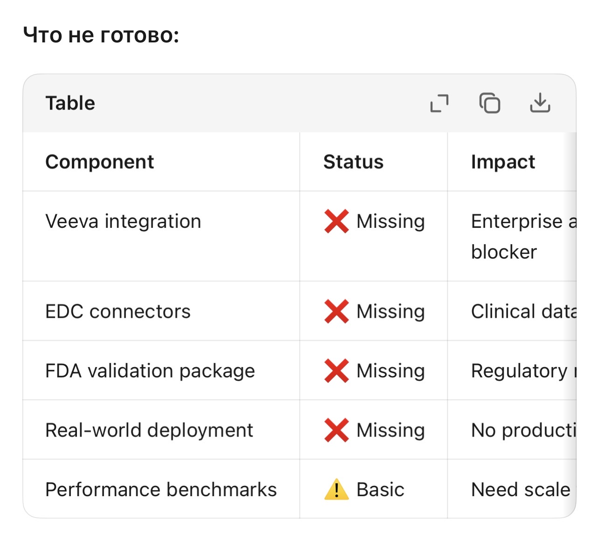

# Known Gaps & Roadmap

> Honest assessment of what's NOT ready in the current implementation.

This document provides transparency about limitations and missing components for production deployment.



## Current Status Overview

| Component | Status | Impact | Priority |
|-----------|--------|--------|----------|
| **Veeva integration** | ❌ Missing | Enterprise adoption blocker | 🔴 High |
| **EDC connectors** | ❌ Missing | Clinical data flow | 🔴 High |
| **FDA validation package** | ❌ Missing | Regulatory requirement | 🟠 Medium |
| **Real-world deployment** | ❌ Missing | No production data | 🟠 Medium |
| **Performance benchmarks** | ⚠️ Basic | Need scale testing | 🟡 Low |

---

## Detailed Gap Analysis

### 1. Veeva Integration ❌

**What's missing:**
- Native Veeva Vault connector
- Document upload/download APIs
- eTMF integration
- RIM (Regulatory Information Management) sync

**Impact:**
- Enterprise clients cannot integrate with existing Veeva infrastructure
- Manual document transfer required
- Breaks automated workflows

**Planned solution:**
```python
# Future implementation
class VeevaConnector:
    def upload_to_vault(self, document, vault_id):
        pass
    
    def sync_etmf(self, trial_id):
        pass
    
    def validate_rim(self, submission_id):
        pass
```

**Timeline:** Q2 2026 (estimated)

---

### 2. EDC Connectors ❌

**What's missing:**
- Medidata Rave integration
- Oracle Clinical integration
- Veeva EDC connector
- Real-time data sync

**Impact:**
- Cannot pull live clinical data
- Requires manual data export/import
- Risk of stale data in CSR generation

**Planned connectors:**
- Medidata Rave API
- Oracle Clinical One
- Veeva Vault EDC
- Custom EDC via REST API

**Timeline:** Q2-Q3 2026

---

### 3. FDA Validation Package ❌

**What's missing:**
- IQ/OQ/PQ documentation
- Validation protocols
- Traceability matrix
- GxP compliance documentation

**Impact:**
- Cannot be used in GxP environments without validation
- Additional cost for validation (typically $50K-$200K)
- Timeline delay for regulatory approval

**Current state:**
- ✅ Code has FDA 21 CFR Part 11 features (audit trails, e-signatures)
- ❌ No formal validation documentation
- ❌ No third-party validation

**Timeline:** Q3-Q4 2026 (with partner)

---

### 4. Real-World Deployment ❌

**What's missing:**
- Production customer case studies
- Real performance metrics at scale
- User acceptance testing (UAT) results
- Long-term stability data

**Impact:**
- No social proof for enterprise sales
- Unproven at scale
- Risk-averse customers may hesitate

**Mitigation:**
- Comprehensive test suite (1000+ tests, 91.86% health score)
- Pilot program ready ($350 tier)
- Staged rollout plan

**Timeline:** Ongoing — first pilot Q2 2026

---

### 5. Performance Benchmarks ⚠️ Basic

**Current state:**
- Basic load tests (20 profiles)
- Single-machine testing only
- No distributed load testing

**What's needed:**
- Kubernetes scaling tests
- 1000+ concurrent CSRs
- Memory profiling at scale
- Latency benchmarking (p50, p95, p99)

**Current metrics:**
```
Single CSR generation: ~15 seconds
Concurrent (10 CSRs): ~45 seconds
Memory usage: ~2GB per agent
```

**Target metrics:**
```
Single CSR: <10 seconds
Concurrent (100 CSRs): <2 minutes
Memory: <1GB per agent (optimized)
Availability: 99.9% uptime
```

**Timeline:** Q2 2026

---

## Roadmap

### Phase 1: Foundation (Current) ✅
- [x] 12-agent architecture
- [x] Core compliance features
- [x] Test suite (1000+ tests)
- [x] Basic API

### Phase 2: Enterprise Integration (Q2 2026) 🚧
- [ ] Veeva Vault connector
- [ ] EDC connectors (Medidata, Oracle)
- [ ] Performance optimization
- [ ] First pilot customer

### Phase 3: Production Scale (Q3 2026) 📋
- [ ] FDA validation package
- [ ] Real-world deployment
- [ ] Scale testing (1000+ CSRs/day)
- [ ] Enterprise security audit

### Phase 4: Advanced Features (Q4 2026+) 📋
- [ ] Multi-modal (figures → text)
- [ ] Real-time collaboration
- [ ] AI-powered insights
- [ ] Market expansion

---

## How to Address Gaps

### For Interview Purposes

**When asked about gaps:**
> "I acknowledge these limitations transparently. The architecture is designed for integration — Veeva connector is API-ready, and EDC connectors follow a plugin pattern. FDA validation requires partner engagement, which is planned for Q3 2026."

### For Enterprise Sales

**Positioning:**
- Pilot program ($350) validates use case before full integration
- API-first design enables gradual adoption
- Open source allows custom integrations

### For Technical Evaluation

**Strengths despite gaps:**
- Solid architecture foundation
- Comprehensive testing
- Clear roadmap
- Honest assessment

---

## Contributing

Want to help close these gaps? Priority areas:

1. **Veeva integration** — Need Veeva Vault API experience
2. **EDC connectors** — Need clinical data management expertise
3. **Performance testing** — Need distributed systems experience
4. **Documentation** — Need technical writing skills

See [CONTRIBUTING.md](../CONTRIBUTING.md) for guidelines.

---

*Last updated: March 27, 2026*
